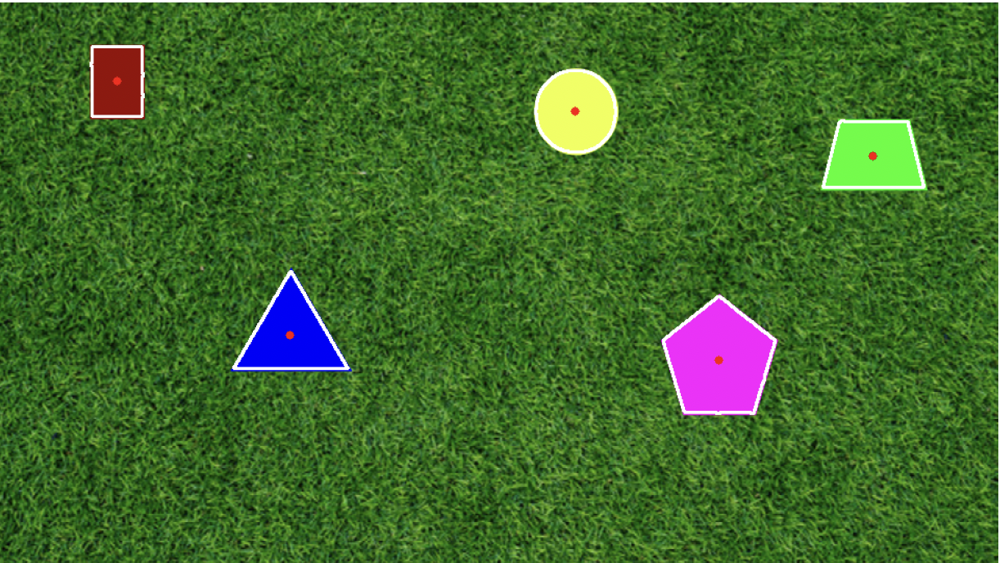

# Penn Air Software Application 2025

This project implements a shape detection pipeline that started from simple masking and evolved to an **optical-flow-based** method with **contour refinement** and a **3D extension** using basic pinhole optics.

- **Static images:** Detect and overlay shapes/centers  
- **Dynamic videos:** Robust to backgrounds & colors via pruning/refinement  
- **3D (meters):** Estimate (X, Y, Z) of detected shapes using intrinsics + known circle size  
- **ROS2:** Not completed

---

## Installation

> Requires Python 3.8+.

```bash
# 1) Clone and enter the repo
git clone https://github.com/rishabh-tole/rishabh-pennair
cd rishabh-pennair

# 2) Install dependencies
pip3 install -r requirements.txt
```

---

## Files

- **shape_detector.py** — Core class: optical flow (forward diff), tolerant zero-map, neighbor pruning, contour drawing.  
- **part1.py** — Static image pipeline; quick visual overlay (Matplotlib).  
- **part2.py** — Dynamic video pipeline; real-time overlay + compute-FPS.  
- **part3.py** — Advanced refinement for dynamic video (large-window region consistency + thresholds).  
- **part4.py** — 3D extension: estimates depth from a known circle radius and camera intrinsics, then computes (X, Y, Z).

---

## How to Run

Update the input paths inside each script to match your files.  
Look for `IMG_PATH` / `VIDEO_PATH` at the top of each `part*.py`.

---

### 1) Static Image (part1)

Detect shapes from a single image and show contours/centers:

```bash
python3 part1.py
```

Default expects `pennair_static.png` (see `IMG_PATH` in part1.py).

---

### 2) Dynamic Video (Basic) — part2

Process a video stream and show a live overlay with compute FPS:

```bash
python3 part2.py
```

Default expects `pennair_dynamic_ez.mp4` (see `VIDEO_PATH` in part2.py).

---

### 3) Dynamic Video (Advanced Refinement) — part3

Adds large-window region-consistency pruning and optional morphology:

```bash
python3 part3.py
```

Default expects `PennAir 2024 App Dynamic Hard.mp4` (see `VIDEO_PATH`).

Key tunables in `part3.py`:

- `GAUSS_SIGMA` — pre-blur to reduce noise  
- `TOL_X, TOL_Y` — tolerant zero-map thresholds  
- `MIN_ADJ` — neighbor count threshold  
- `PRUNE_N` — small-neighborhood prune radius (1 → 3×3)  
- `LARGE_PRUNE_WIN` — second-stage window size (odd)  
- `FILL_THRESHOLD, CLEAR_THRESHOLD` — hysteresis-like fill/clear  
- `MORPH_CLOSE, MORPH_KERNEL_SIZE` — smoothing  

---

### 4) Simple 3D Localization — part4

Estimates plane depth using a detected reference circle (known real radius), then computes `(X, Y, Z)` of each detected shape:

```bash
python part4.py
```

Default expects `pennair_dynamic_ez.mp4` (edit `VIDEO_PATH`).

Camera intrinsics (in pixels) and real circle radius (meters) are set at top of `part4.py`:

```python
FX = 2564.3186869
FY = 2569.70273111
REAL_RADIUS_M = 0.254  # 10 inches
```

**Assumptions:**

- Pinhole model; principal point at image center of processed frame.  
- Flat scene at average depth estimated over the first ~5 seconds.  
- Reference circle detection used to infer depth:  
  `Z = (FX * REAL_RADIUS_M) / r_px`

---

## My Thought Process

**Initial idea — Masking:**  
At first, masking felt like the simplest approach. But it wouldn’t generalize across scenes.

**Switch to optical flow (forward differences):**  
Given the solid shapes and a background with large pixelwise intensity changes, I used a 1-pixel shift + subtraction (forward difference in x/y). This worked well but left many holes. This should, ideally, work for any solid shape against noisy background, and be extremely computationally efficient.

**Filling the holes:**

- Blur → subtract → invert (0 → 1, nonzero → 0).  
- Convolve with an all-ones kernel (except center).  
- If local white fraction ≥ threshold → flip to white.  
- If local white fraction ≤ threshold → flip to black.  

After contour extraction, discard small blobs (area < 1000 px).

**Dynamic video:**  
Tuned parameters and added a larger prune kernel for robustness. It became less efficient but agnostic to background and shape color.

**3D extension:**  
Leveraged optics: detect a circle, use its known real radius and measured pixel radius to estimate depth (Z), then compute `(X, Y, Z)` via intrinsics.

**ROS2:**  
Began a ROS2 node for publishing detections, but did not complete integration.

---

## Configuration Highlights

Each script exposes key parameters near the top:

**part1/part2/part3**

- `SHIFT` — forward-diff shift (pixels)  
- `GAUSS_SIGMA` — Gaussian blur sigma (0 disables)  
- `TOL_X, TOL_Y` — tolerated |dx|, |dy| thresholds  
- `MIN_ADJ` — neighbor count threshold (> MIN_ADJ keeps pixel)  
- `MIN_AREA` — contour area threshold (px²)  
- `PRUNE_N` — small-neighborhood radius (1 → 3×3, 2 → 5×5, …)  

**part3 (extra)**

- `LARGE_PRUNE_WIN` — large window for regional consistency (odd)  
- `FILL_THRESHOLD, CLEAR_THRESHOLD` — hysteresis flip controls  
- `MORPH_CLOSE, MORPH_KERNEL_SIZE` — optional closing  

**part4 (3D)**

- `FX, FY` — focal lengths in pixels  
- `REAL_RADIUS_M` — real circle radius in meters  
- Uses most circular contour (via circularity `4πA/P²`) for reference  

---

## Demo

Here is what my algorithm looks like for the static Image:




Here is what my algorithm looks like for the easy video:


I have created a video visualizing the different steps of my algorithm, here is the video below:


And here is the clean version:


Finally, here is the part 4 demo:


---

## Improvements

There are a few places where I think this algorithm can be significantly improved.

The first is tracing shapes through overlap and making sure that centers stay at the actual center. I have an idea of how this can be done.

First, we reimagine the contour drawing. When the original contours are drawn, we check for the first few frames to see if the areas are constant. This makes sure that we have outlined all the shapes in their entirety. Then, we make a number of points (ideally at the edges) using only a small fraction of the points. Every time you draw contours, you draw the points at the same spots (this part is a little tricky but can be done).  

Next, you compute the translation vector between the corresponding points from frame *n+1* and frame *n*. If the shape has no overlap with another shape, then the translation vector between all the points framewise should be the same.  

When there is overlap, there will no longer be the same translation vector between all points. At this point, you take the vector that appears the most times, and then add it to the *n* frame. That way you should get the (overlap agnostic) *n+1* frame position.  

Finally, just draw lines to connect all the dots.

